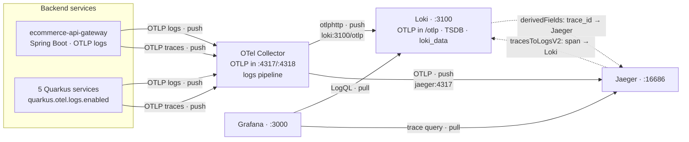

# Spec: Log Aggregation — Grafana Loki (OTLP-native)

## Objective

Add a centralized **log aggregation** backend so logs are searchable, retained, and
clickable-through to traces — closing the gap left open by `observability.md`, which deferred
log aggregation and kept logs on container **stdout** only (`grep` across `make logs` was the
only search). All 6 backend services ship their logs to **Grafana Loki**, queryable in Grafana
beside the existing Prometheus (metrics) and Jaeger (traces) datasources.

**Goals:**
- Every backend service's logs land in Loki, queryable by `service`, level, time, and
  arbitrary structured fields via LogQL.
- `traceId`/`spanId` arrive as **structured fields** (not parsed out of text), so a log line
  links one-click to its trace in Jaeger, and a trace span links back to its logs.
- Logs continue to emit to **stdout** unchanged — `make logs` and console debugging still work.
- The stack stays startable from the Makefile (`make observability` / `make up`); Loki rides
  the existing `observability` compose profile.

**Out of scope:**
- Frontend (browser) log shipping.
- Log-based alerting rules (Loki ruler) — a later follow-up.
- A production-grade clustered Loki deployment — see *Scaling path*; this spec ships
  single-binary, shaped for a config-only scale-up.

---

## Current State (assessment)

### What exists and works
- **Tracing + metrics** through an **OTel Collector** → Jaeger (traces) and Prometheus →
  Grafana (metrics). See `docs/specs/observability.md` / `docs/adr/0001-...`.
- **Structured logging** — every service emits key=value lines carrying `traceId`/`spanId`
  from MDC (Quarkus `quarkus.log.console.format`; gateway `logging.pattern.level`). Conventions
  in `docs/conventions/logging-conventions.md`.
- **OTLP everywhere** — all services already export OTLP traces to `otel-collector:4317`.

### Verified gap
| # | Gap | Evidence |
|---|-----|----------|
| 1 | Logs are stdout-only — no central store, no retention, no UI search | `docker-compose.yml` observability profile has otel-collector/jaeger/prometheus/grafana but no log backend; `observability.md:20` lists log aggregation as out-of-scope |
| 2 | No log↔trace click-through | Grafana has Prometheus + Jaeger datasources only (`datasources.yml`) |

---

## Target Architecture

| Concern | Choice |
|---|---|
| Log backend | **Grafana Loki** (single-binary, filesystem store, TSDB schema) |
| Shipping path | **OTLP-native** — services emit OTLP logs to the **existing** `otel-collector`; the Collector exports to Loki |
| Collector → Loki | `otlphttp` exporter → Loki's native OTLP endpoint (`http://loki:3100/otlp`) |
| Quarkus logs | `quarkus.otel.logs.enabled=true` (reuses the existing OTLP exporter endpoint) |
| Gateway logs | Spring Boot 3.4 OTLP log auto-config + OpenTelemetry Logback appender |
| Visualization | Grafana — new **Loki** datasource beside Prometheus + Jaeger |
| Correlation | Loki `derivedFields` (`trace_id` → Jaeger) + Jaeger `tracesToLogsV2` (span → Loki) |
| stdout | unchanged — OTLP export is **additive**; console handler stays on |

**Decision — Loki over ELK.** Grafana already runs, so Loki is one more datasource (one pane of
glass) rather than a second UI (Kibana). Loki indexes only labels and stores compressed chunks,
so it is far lighter than Elasticsearch's JVM + full-content indexing — material for a local
Docker stack — and our logs are structured + `trace_id`/`service`-scoped (Loki's sweet spot),
not blind full-text search (ELK's). Full rationale: `docs/adr/0007-log-aggregation-loki.md`.

**Decision — OTLP-native shipping over stdout-scraping.** Services emit OTLP logs to the
Collector we already run, so `traceId`/`spanId` arrive as real structured fields with no regex
parsing, and the path reuses the existing OTLP pipeline. The alternative (Alloy/Promtail
scraping container stdout) needs pipeline stages to re-parse `traceId` out of text and adds a
component; rejected. Console/stdout logging is untouched.

---

## New HTTP / infra surface

| Surface | Where | Purpose |
|---|---|---|
| Loki `:3100` | new `loki` container (observability profile) | OTLP log ingest (`/otlp`) + LogQL query + `/ready` |
| `otlphttp/loki` exporter + `logs` pipeline | `observability/otel-collector-config.yaml` | forward OTLP logs to Loki |
| Loki datasource | Grafana provisioning | LogQL queries + log↔trace pivot |

No business API changes — no OpenAPI contract change.

---

## Scaling path

Loki scales to very high volume in production (it backs Grafana Cloud at petabyte/day). Whether
it scales is a function of **deployment topology**, and crucially **the application side never
changes** — services → otel-collector → `otlphttp` → Loki is identical at any size; only Loki's
own topology + storage backend change.

| Mode | Storage | Scales | Use |
|------|---------|--------|-----|
| Monolithic / single-binary (this spec) | filesystem | vertical | dev + modest prod |
| Simple Scalable (read/write/backend) | object store (S3/GCS) | horizontal | prod up to ~TB/day |
| Microservices | object store | horizontal, fine-grained | very large scale |

To grow: swap the single binary for SSD targets (or the Loki Helm chart in `kubernetes/`) and
the `filesystem` store for `s3` (LocalStack is already in the stack for local S3). The Loki
config keeps `storage_config`/`schema_config` isolated so this is a localized change. The OTel
Collector is the scaling seam — it batches and can fan out / load-balance to a clustered Loki
and drop noisy logs, all without touching any service. Full trade-offs in the ADR.

---

## Verification

1. `make up` (or `make observability`). `curl -s localhost:3100/ready` → `ready`.
2. Generate traffic: login → browse products → create an order (fans out to products + price
   over HTTP, and products → Kafka → featured-products).
3. **Grafana → Explore → Loki** (`:3000`): `{service_name="orders-service"}` returns lines with
   `trace_id` present as a field (proves OTLP-native shipping, not text scraping).
4. **Log → trace:** click a line's `traceID` → lands on the trace in Jaeger.
   **Trace → log:** open the trace, "Logs for this span" → back to the Loki lines.
5. Cross-service: `{} | trace_id="<id>"` returns lines from every service on the path
   (gateway + orders + products + price + featured-products).
6. `make logs` still streams the same console lines (stdout unaffected).
7. Restart `loki`; prior logs persist (the `loki_data` volume).

---

## References

- Decision record: `docs/adr/0007-log-aggregation-loki.md`
- Builds on: `docs/specs/observability.md`, `docs/adr/0001-observability-tracing-and-metrics-stack.md`
- Logging conventions: `docs/conventions/logging-conventions.md`
