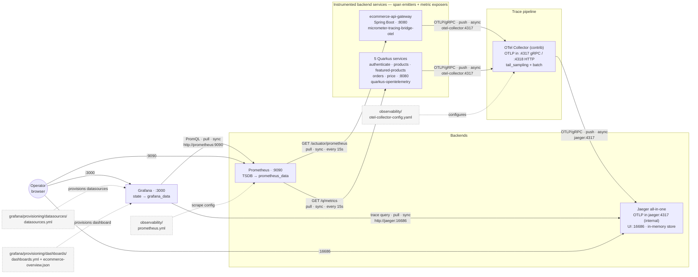

# Spec: Observability — Distributed Tracing & Metrics

## Objective

Give the platform end-to-end **distributed tracing** and **metrics**, replacing the current
log-only correlation with real trace trees. A single user request — gateway → orders-service →
products-service / price-service over HTTP, and products-service → Kafka → featured-products-service —
must appear as **one connected trace**, and every service must export metrics scrapeable by Prometheus
and visualizable in Grafana.

**Goals:**
- One trace spans the gateway and every downstream service it touches, over HTTP **and** Kafka —
  including events published via the transactional outbox, whose relay re-parents the producer span
  on the originating request (`OutboxTracing`, `outbox-common`).
- `traceId` / `spanId` appear on every log line, so logs pivot to traces.
- Per-service metrics (request rate, latency, error rate, JVM, Kafka) in Prometheus + Grafana.
- A local observability stack (OTel Collector + Jaeger + Prometheus + Grafana) startable from the Makefile.

**Out of scope:**
- Log aggregation (Loki/ELK) — logs stay on stdout, now carrying `traceId`.
- Frontend (browser) tracing.

**Decision — retire the parallel `X-Request-ID` correlation id.** Once OTel is on the classpath,
`traceId`/`spanId` are in the MDC of *every* request regardless of sampling (sampling only governs
export to Jaeger, not id generation), so the hand-rolled `requestId` is redundant for internal
correlation and is also Jaeger-linkable, which `requestId` is not. We standardize on `traceId`:
- Remove the `requestId` MDC plumbing from the 6 Quarkus request filters and the gateway
  `RequestIdGlobalFilter` (the request filters stay — they still log method/path/userId).
- If a client-facing handle is needed, echo the **`traceId`** back in a response header at the gateway.
- Net: one correlation id end to end, instead of two on every log line.

---

## Current State (assessment)

### What exists and works
- **Manual `X-Request-ID` correlation.** Gateway mints a UUID per request and forwards it as
  `X-Request-ID` (`RequestIdGlobalFilter`, `GatewayRequestLoggingFilter`). All 6 Quarkus services
  read it into MDC and stamp every log line via `quarkus.log.console.format=... requestId=%X{requestId}`.
- **Structured logging conventions** — `docs/conventions/logging-conventions.md` (key=value,
  mandatory `elapsed=` on cross-service calls, symmetric Kafka produce/consume logging).
- **Health/readiness probes** — gateway `/actuator/health/liveness`; Quarkus `/q/health/ready`
  with custom `MongoReadinessCheck` in the 4 Mongo services.

### Verified gaps
| # | Gap | Evidence |
|---|-----|----------|
| 1 | Outbound HTTP correlation broken — `X-Request-ID` not forwarded on orders→products / orders→pricing calls | No `ClientRequestFilter`/`ClientHeadersFactory` anywhere in backend (grep `NONE FOUND`) |
| 2 | Kafka carries no context — chain breaks at the broker | `KafkaEventPublisher` sets only a key; `KafkaEventConsumer` extracts nothing |
| 3 | Dead tracing deps in gateway | `pom.xml` ships brave/zipkin/prometheus registries; `application.yml` exposes only `health` |
| 4 | No real tracing — no traceId/spanId, only requestId (not a span tree) | No OTel on any service |
| 5 | No metrics export | No `quarkus-micrometer-registry-prometheus`; gateway prometheus endpoint not exposed |
| 6 | No observability infra | `docker-compose.yml` has no Jaeger/Tempo/Prometheus/Grafana; no Makefile targets |

OpenTelemetry uses **W3C `traceparent`** by default. Once `quarkus-opentelemetry` is on the
classpath, Quarkus auto-instruments JAX-RS, MicroProfile Rest Client, JDBC/Mongo, and SmallRye
Reactive Messaging (Kafka). Gaps #1 and #2 therefore close **via automatic context propagation** —
no hand-written client filter is needed.

---

## Target Architecture

| Concern | Choice |
|---|---|
| Trace pipeline | services → **OTel Collector** (OTLP in on 4317/4318) → Jaeger (OTLP out) |
| Trace backend | Jaeger all-in-one, native OTLP ingest (UI 16686; OTLP internal as `jaeger:4317`) |
| Metrics store | Prometheus (scrapes `/q/metrics` on Quarkus, `/actuator/prometheus` on gateway) |
| Visualization | Grafana, provisioned with Prometheus + Jaeger datasources |
| Propagation | W3C `traceparent` across HTTP and Kafka, end to end |
| Quarkus tracing | `quarkus-opentelemetry` extension, OTLP exporter → `otel-collector:4317` |
| Quarkus metrics | `quarkus-micrometer-registry-prometheus` extension |
| Gateway tracing | `micrometer-tracing-bridge-otel` + `opentelemetry-exporter-otlp` (replaces brave/zipkin) |
| Gateway metrics | `micrometer-registry-prometheus` (already present), `prometheus` actuator endpoint exposed |
| Sampling | services export `always_on`; **tail sampling at the Collector** — keep all error/slow traces, sample ~10% of the rest |
| Logs | log format gains `traceId=%X{traceId} spanId=%X{spanId}`; `requestId` removed (see decision below) |

Compose services live under an `observability` profile so `make infra` stays lean.

**Decision — route traces through an OpenTelemetry Collector.** Every service exports OTLP to a
central `otel-collector` (contrib distro, for the `tail_sampling` processor), which forwards traces
to Jaeger over OTLP. The Collector exists for **tail sampling**: because it buffers the whole trace
before deciding, it keeps 100% of error and slow traces and samples only ~10% of routine ones —
something head sampling at the source cannot do (it drops blindly, errors included). For this to
work the services sample at `always_on` so the Collector sees every span; the keep/drop decision
lives in the Collector, not the services. The Collector owns the host OTLP ports (4317/4318); Jaeger's
OTLP listener stays internal (`jaeger:4317`) for the Collector→Jaeger hop. Trade-off: one extra
container to run, accepted for not losing the traces that matter.

---

## Monitoring Stack — Interaction Diagram

How the four monitoring containers wire together at runtime, the files/datasources that configure
each one, and the **direction (push/pull)** and **timing (sync/async)** of every hop. Spans
originate in the services (W3C `traceparent` across HTTP and Kafka); metrics are exposed by each
service and pulled by Prometheus.

> **Reading the arrows:** each arrow points from the **initiator of the connection** to its target.
> For *push* links (OTLP export) the data travels the same direction as the arrow; for *pull* links
> (Prometheus scrape, Grafana query) the request goes along the arrow and the **data flows back**.

### Communication, per hop

| Hop | Protocol / endpoint | Initiated by | Push/Pull | Sync/Async | Cadence |
|-----|---------------------|--------------|-----------|------------|---------|
| services → Collector | OTLP/gRPC `otel-collector:4317` (HTTP `:4318` available) | the service SDK | **push** | **async** — batched, off the request thread | continuous |
| Collector → Jaeger | OTLP/gRPC `jaeger:4317` (internal only) | the Collector | **push** | **async** — after the 10 s tail-sampling buffer + `batch` | continuous |
| Prometheus → gateway | HTTP `GET /actuator/prometheus` | Prometheus | **pull** (scrape) | **sync** request/response | every 15 s |
| Prometheus → Quarkus ×5 | HTTP `GET /q/metrics` | Prometheus | **pull** (scrape) | **sync** request/response | every 15 s |
| Grafana → Prometheus | HTTP PromQL `http://prometheus:9090` | Grafana | **pull** (query) | **sync** — on panel render/refresh | on demand |
| Grafana → Jaeger | HTTP trace query `http://jaeger:16686` | Grafana | **pull** (query) | **sync** — on trace lookup | on demand |
| Operator → Grafana / Jaeger / Prometheus UIs | HTTP host ports `:3000` / `:16686` / `:9090` | browser | pull | sync | on demand |

Why the split: traces are **pushed** because the source decides when a span ends and can't be polled
for in-flight work; metrics are **pulled** because Prometheus owns the scrape schedule and target
discovery, and a missed scrape is itself a health signal. The Collector→Jaeger hop is async by
design — tail sampling must buffer the *whole* trace before deciding keep/drop, so export lags the
spans by up to `decision_wait` (10 s).

### Files & datasources involved

| Component | Artifact | File / volume (mounted `:ro` unless a volume) | Role |
|-----------|----------|-----------------------------------------------|------|
| OTel Collector | config | `observability/otel-collector-config.yaml` | OTLP receivers (4317/4318), `tail_sampling` policies, `otlp/jaeger` exporter |
| Prometheus | scrape config | `observability/prometheus.yml` | 7 jobs: self + gateway + 5 Quarkus |
| Prometheus | metric store | `prometheus_data` volume | TSDB persistence across restarts |
| Grafana | datasources | `observability/grafana/provisioning/datasources/datasources.yml` | **Prometheus** (`uid: prometheus`, default) + **Jaeger** (`uid: jaeger`), `access: proxy` |
| Grafana | dashboard provider | `observability/grafana/provisioning/dashboards/dashboards.yml` | file provider scanning the dir for `*.json` |
| Grafana | dashboard | `observability/grafana/provisioning/dashboards/ecommerce-overview.json` | *Ecommerce Overview* (RED + JVM + Kafka, by `job`) |
| Grafana | internal state | `grafana_data` volume | users, prefs, UI-side edits (survives restart) |
| Jaeger | trace store | — (all-in-one, **in-memory**; no volume) | traces are lost on restart by design (local dev) |
| each service | trace/metric SDK config | service `application.properties` / gateway `application.yml` | OTLP endpoint, `always_on` sampler, Micrometer Prometheus registry |

All four config files reach their container through the bind mounts declared on the `observability`
profile in `docker-compose.yml`; the two named volumes (`prometheus_data`, `grafana_data`) hold the
only state that must outlive a container restart. Jaeger intentionally keeps none — acceptable for a
local stack.

---

## New HTTP surface

| Endpoint | Service | Purpose |
|---|---|---|
| `/q/metrics` | each Quarkus service | Prometheus scrape target |
| `/actuator/prometheus` | gateway | Prometheus scrape target |

These are suppressed in request-logging filters (Quarkus filters already skip `/q/`; gateway
filter already skips `/actuator`). No business API changes, so no OpenAPI contract change.

---

## Verification

1. `make up` + `make observability`; generate traffic (login → browse products → create order,
   which fans out to products-service + price-service and triggers a Kafka product/price event
   consumed by featured-products-service).
2. **Jaeger** (:16686): one trace — exported by every service to the Collector, tail-sampled, and
   forwarded to Jaeger — spans gateway → orders → products → pricing over HTTP **and**
   products → (Kafka) → featured-products — direct proof gaps #1 and #2 are closed. An errored or
   slow request is always retained (tail-sampling keep policies), even though routine ones are sampled.
3. **Prometheus** (:9090): all 7 targets `UP`.
4. **Grafana** (:3000): dashboard renders; trace links resolve to Jaeger.
5. `grep traceId=<id>` across `make logs` returns correlated lines from every service in the path.

---

## References

- Decision record: `docs/adr/0001-observability-tracing-and-metrics-stack.md`
- Task plan: `docs/tasks/observability-plan.md` / `docs/tasks/observability-todo.md`
- Logging conventions (to be updated in Phase 6): `docs/conventions/logging-conventions.md`
